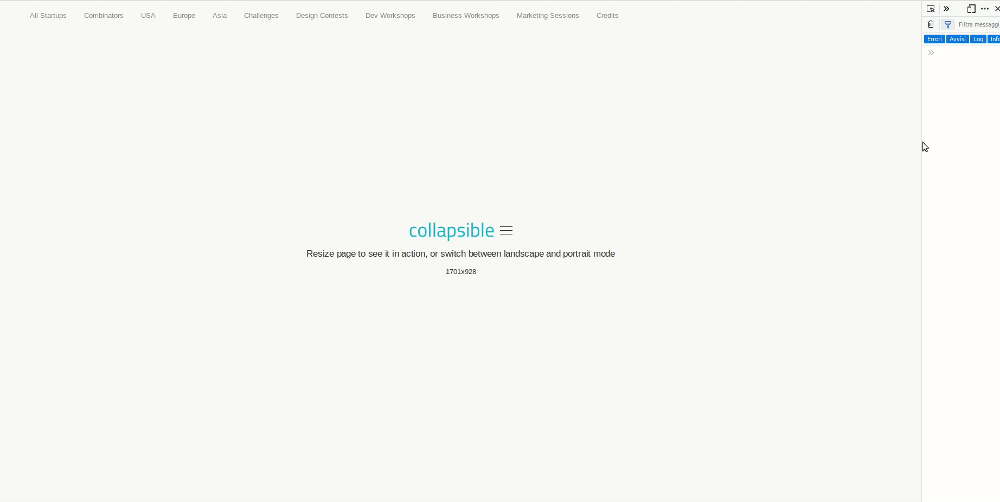

<p align="center">
    
</p>

<p align="center">
    <em>Collapse navbar items dynamically, when there isn't enough space on the screen.</em>
</p>

<hr />



## ⚠️ This project is unmaintained ⚠️

## Installation

**It requires [DOM4](https://github.com/WebReflection/dom4#dom4) to work on IE >= 10**

**It requires [ResizeSensor](https://cdn.jsdelivr.net/npm/resize-sensor@0.0.6/ResizeSensor.min.js) to work correctly.**

### Using pre-generated asset

Copy the `collapsible.js` file, available in the `dist` folder, and include it
in your HTML page.

### Manually

**You must have Node and npm installed on your system.**

Clone this repository:

```shell
git clone https://github.com/domcorvasce/collapsible
```

Then, go into the folder and install the development dependencies:

```shell
cd collapsible
yarn
```

You're ready to build the asset:

```shell
yarn build
```

## Usage

```html
<!-- .... -->
<div class="navbar navbar-lg no-padding no-box-shadow navigation-bar">
    <ul class="nav navbar-nav nav-tabs nav-tabs-bottom bottom-divided no-margin">
        <li><a href="#startups">All Startups</a></li>
        <li><a href="#combinators">Combinators</a></li>
        <li><a href="#usa">USA</a></li>
        <li><a href="#europe">Europe</a></li>
        <li><a href="#asia">Asia</a></li>
        <li><a href="#challenges">Challenges</a></li>
        <li><a href="#designcontests">Design Contests</a></li>
        <li><a href="#devws">Dev Workshops</a></li>
        <li><a href="#businessws">Business Workshops</a></li>
        <li><a href="#marketingsessions">Marketing Sessions</a></li>
        <li><a href="#credits">Credits</a></li>
    </ul>
</div>
<!-- .... -->
```

```js
const collapsible = new Collapsible('.navbar-nav', 200);
collapsible.render();
```

### Constructor

- **selector**: represents the container of the items to collapse
- **threshold**: the minimum amount of available space before the collapse event is triggered

### Methods

- **render**: inject the collapsed menu and start looking for items to collapse

## License

Released under [MIT license](LICENSE).
